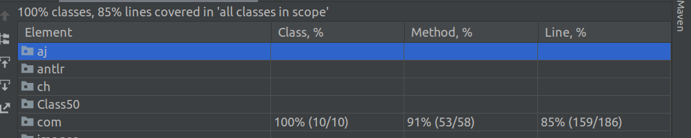

# open weather api demo

## Implantation

When this spring boot app is launched, it reads configuration csv file `config.csv` from the resource. 
Fetch data from open weather and save in the H2 in memory database. 

There are 3 REST endpoint implemented. 

GET http://localhost:8080/weather/all  
Returns all entry from the H2 in memory database. 

GET http://localhost:8080/weather/city/espoo  
Returns only the given city as path variable.

POST http://localhost:8080/weather/cityByFrequency/espoo  
It reads H2 last entry to get the configuration from `config.csv`. Then it calls open server according to the given 
configuration. Last data is inserted to H2.      
 
## How to execute this project   

I dockerized the app so that anybody call run it by docker. Prerequisite docker and docker-compose must be installed.
Port 8080 must be free

Just run `docker-compose up --build` command from the project root where `docker-compose.yml` is located. 

In case docker is not available, you can run by Java and Maven. 
I used the latest JDK 17. Prerequisites are JDK 17 and Maven.

Just run `mvn springt-boot:run` command from the project root where `pom.xml` is located.

## Requirements 

Our imaginary Product Owner has indicated that the weather provider might change in the future. 
That is why `openWeatherUrl` defined in `application.properties`. 
Building of the open weather URI is kept completely out of application core logic. So if it changes in the future, it can be updated easily.

## Unit Test Coverage report

As you can see, more than 85% of the line was unit tested.  